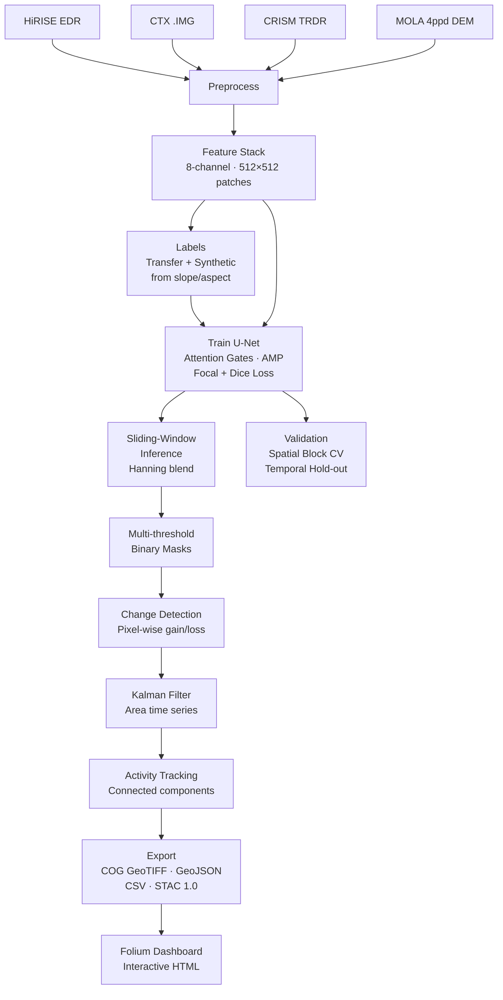
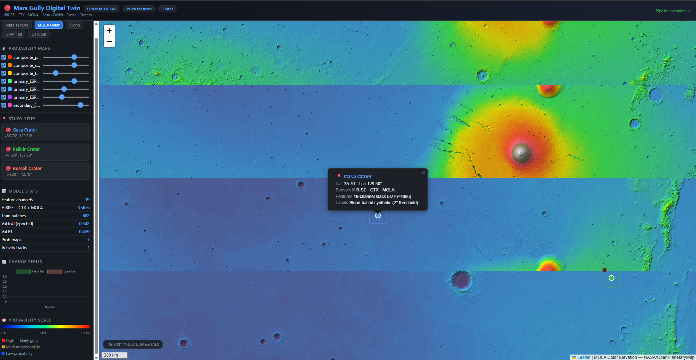

# Mars Gully Digital Twin

[](https://www.python.org/)
[](https://pytorch.org/)
[](LICENSE)
[](https://github.com/psf/black)
[](https://doi.org)

> A production-ready multi-sensor deep learning pipeline for detecting and monitoring Mars gully activity from HiRISE, CTX, CRISM, and MOLA imagery.

---

<p align="center">
  
  <br>
  <em>Interactive Mars Gully Digital Twin Dashboard — Gasa, Palikir, and Russell Craters</em>
</p>

## Abstract

Mars gullies are among the most dynamically active geomorphological features on the Martian surface, with documented morphological changes occurring on sub-decadal timescales. Understanding their formation and evolution is critical for constraining present-day volatile transport, periglacial processes, and the potential for transient liquid water. This pipeline implements a complete planetary digital twin for multi-temporal gully detection and change monitoring across three high-activity crater sites: **Gasa** (−35.7°N, 129.5°E), **Palikir** (−41.5°N, 202.3°E), and **Russell** (−54.3°N, 12.9°E).

The system fuses HiRISE (25–50 cm), CTX (6 m), CRISM spectral, and MOLA morphometric data into an 8-channel feature stack processed by an attention-gated U-Net trained from scratch on Mars-domain imagery. Post-processing combines Kalman-filtered area time series, connected-component activity tracking, and a STAC 1.0 export with an interactive Folium dashboard. Target metrics: IoU > 0.65, F1 > 0.75 (spatial block cross-validation).

---

## Pipeline Architecture



---


## Dashboard Preview



*The interactive Folium dashboard enables exploration of gully detection results with multiple Mars basemap options, probability map overlays, and time-series change analysis.*
## Study Areas

| Site | Lat/Lon | HiRISE obs | Date range | Gully type |
|------|---------|------------|------------|------------|
| Gasa Crater | −35.7°N, 129.5°E | ~12 | 2006–2020 | Alcove-channel-apron |
| Palikir Crater | −41.5°N, 202.3°E | ~18 | 2005–2019 | Pole-facing gullies |
| Russell Crater | −54.3°N, 12.9°E | ~15 | 2007–2021 | CO₂-driven flows |

---

## Data Sources

| Sensor | Resolution | Source |
|--------|-----------|--------|
| HiRISE | 25–50 cm | [PDS EDR](https://hirise-pds.lpl.arizona.edu/PDS/EDR/) |
| CTX | 6 m | [PDS/ODE REST API](https://ode.rsl.wustl.edu/) |
| CRISM | 18–36 m | [WUSTL PDS](https://pds-geosciences.wustl.edu/) |
| MOLA | 463 m (4ppd) | [USGS Planetary Maps](https://planetarymaps.usgs.gov/) |

---

## Installation

### Option A — Docker (recommended)

```bash
git clone https://github.com/your-username/mars-gully-digital-twin.git
cd mars-gully-digital-twin
docker build -t mars-gully .
docker run --gpus all -v $(pwd)/data:/workspace/data mars-gully \
    python main.py --step all
```

### Option B — Local Python environment

```bash
conda create -n mars-gully python=3.10 -y
conda activate mars-gully
pip install -r requirements.txt

# Optional: GPU support (CUDA 12.1)
pip install torch torchvision --index-url https://download.pytorch.org/whl/cu121
```

---

## Quickstart

### Full pipeline (end-to-end)

```bash
python main.py --step all
```

### Individual steps

```bash
# Download raw data
python main.py --step download

# Preprocess (coregister, project, normalise)
python main.py --step preprocess

# Build 8-channel feature stacks
python main.py --step features

# Generate / transfer labels
python main.py --step labels

# Train U-Net (resume from last checkpoint)
python main.py --step train --resume last

# Sliding-window inference
python main.py --step infer

# Threshold probability maps → binary masks
python main.py --step threshold

# Multi-temporal change detection + Kalman + activity tracking
python main.py --step change

# Export COG GeoTIFFs, GeoJSON, CSV, STAC catalog
python main.py --step export

# Interactive Folium HTML dashboard
python main.py --step dashboard

# Spatial block cross-validation
python main.py --step validate

# Temporal hold-out (train 2005-2010, test 2015-2020)
python main.py --step validate --temporal
```

---

## Model Architecture

```
Input (8, 512, 512)
  └─ MarsResNetEncoder (ResNet34-style, no ImageNet pretrain)
       Depths: [32, 64, 128, 256]
  └─ AttentionGate (Schlemper et al. 2019) on each skip connection
  └─ Decoder with bilinear upsample + CBAM attention
  └─ Final 1×1 conv → (1, 512, 512) logit map
```

**Loss:** Combined Focal (γ=2, α=0.25) + Dice (weight=0.5)  
**Optimiser:** AdamW (lr=1e-4, wd=1e-5) + ReduceLROnPlateau  
**AMP:** Mixed-precision FP16 (4× gradient accumulation)

---

## Target Metrics

| Metric | Target | Validation method |
|--------|--------|-------------------|
| IoU | > 0.65 | Spatial block CV (5 folds, 2 km blocks) |
| F1 | > 0.75 | Spatial block CV |
| Precision | > 0.70 | Temporal hold-out |
| Recall | > 0.72 | Temporal hold-out |

---

## Project Structure

```
mars_gully_digital_twin/
├── config.yaml                   ← all hyperparameters
├── main.py                       ← CLI orchestrator
├── requirements.txt
├── Dockerfile
├── scripts/
│   ├── utils.py                  ← logging, checkpointing, config
│   ├── downloaders/              ← HiRISE, CTX, CRISM, MOLA
│   ├── preprocess/               ← coregister, project, normalise
│   ├── features/                 ← spectral indices, texture, morphometrics
│   ├── labels/                   ← label transfer + synthesis
│   ├── dataset/                  ← PyTorch Dataset + spatial sampler
│   ├── models/                   ← U-Net, attention modules, losses
│   ├── train/                    ← training loop + spatial CV
│   ├── inference/                ← sliding-window predict + blend
│   ├── change/                   ← detect, Kalman, activity tracking
│   ├── export/                   ← COG GeoTIFF, GeoJSON, CSV, STAC
│   ├── dashboard/                ← Folium map + Plotly time series
│   └── validation/               ← metrics, spatial CV, temporal CV
├── notebooks/
│   ├── 01_explore_hirise.ipynb
│   ├── 02_generate_labels.ipynb
│   └── 03_visualize_results.ipynb
└── tests/
    ├── test_downloaders.py
    ├── test_preprocess.py
    ├── test_features.py
    └── test_model.py
```

---

## Running Tests

```bash
pytest tests/ -v --tb=short
```

---

## Outputs

After a full pipeline run, the following are generated in `data/outputs/`:

| Output | Location | Format |
|--------|----------|--------|
| Probability maps | `probability_maps/` | GeoTIFF float32 |
| Binary masks | `binary_maps/` | GeoTIFF uint8 (thr 0.3/0.5/0.7) |
| Change maps | `change_detection/` | GeoTIFF (gain/loss/stable) + GeoJSON |
| Area time series | `change_detection/kalman_smoothed.json` | JSON |
| Activity tracks | `change_detection/activity_tracks.json` | JSON |
| STAC catalog | `stac/catalog.json` | STAC 1.0 |
| CSV reports | `reports/` | CSV |
| Dashboard | `dashboard/mars_gully_dashboard.html` | Interactive HTML |
| Training history | `models/training_history.json` | JSON |
| TensorBoard logs | `logs/` | TFEvents |

---

## Configuration

All parameters are controlled via `config.yaml`. Key sections:

```yaml
study_area:
  primary:
    name: "Gasa Crater"
    center_lat: -35.7
    center_lon: 129.5

training:
  in_channels: 8
  training:
    epochs: 100
    learning_rate: 0.0001
    early_stopping_patience: 20
  loss:
    type: combined
    focal_gamma: 2.0
    dice_weight: 0.5

inference:
  sliding_window:
    tile_size: 512
    stride: 256
  thresholds: [0.3, 0.5, 0.7]
  min_gully_area_m2: 500.0
```

---

## Label Generation

Since no openly available Mars gully training masks exist, this pipeline uses three strategies (in priority order):

1. **Transfer from Earth gully databases** (if shapefiles available in `data/labels/earth/`)
2. **QGIS manual annotation** — see `scripts/labels/manual_label_guide.py` for instructions
3. **Synthetic generation** from MOLA morphometrics: pixels with slope > 15° and poleward aspect (135°–315°)

---

## Reproducibility

All pipeline steps use JSON-based `StepCheckpoint` files to enable resume at any point. Set a fixed seed in `config.yaml`:

```yaml
training:
  seed: 42
```

---

## Citation

If you use this pipeline in your research, please cite:

```bibtex
@software{appiah_kubi_2026_mars_gully,
  author       = {Appiah Kubi, Samuel},
  title        = {Mars Gully Digital Twin: Multi-Sensor Deep Learning Pipeline
                  for Planetary Change Detection},
  year         = {2026},
  publisher    = {GitHub},
  journal      = {GitHub repository},
  howpublished = {\url{https://github.com/your-username/mars-gully-digital-twin}},
  note         = {Copernicus Master's in Digital Earth — Portfolio Project}
}
```

For the U-Net with attention gates:

```bibtex
@article{schlemper2019attention,
  title={Attention gated networks: Learning to leverage salient regions in medical images},
  author={Schlemper, Jo and Oktay, Ozan and Schaap, Michiel and others},
  journal={Medical Image Analysis},
  volume={53},
  pages={197--207},
  year={2019}
}
```

---

## Related Work

- Dundas et al. (2019) — *Granular flows at steep slopes on Mars*. Science
- Pilorget & Forget (2016) — *Formation of gullies on Mars by debris flows*. Nature Geoscience
- Raack et al. (2015) — *Present-day seasonal gully activity in a south polar pit*. Icarus
- Conway et al. (2018) — *New slope wind erosion and deposition in gully alcoves*. Geophysical Research Letters

---

## Contributing

Issues and pull requests are welcome. Please run `pytest tests/ -v` before submitting PRs.

---

## License

MIT — see [LICENSE](LICENSE)

---

*Samuel Appiah Kubi · Incoming Copernicus Master's in Digital Earth, Sept 2026*
